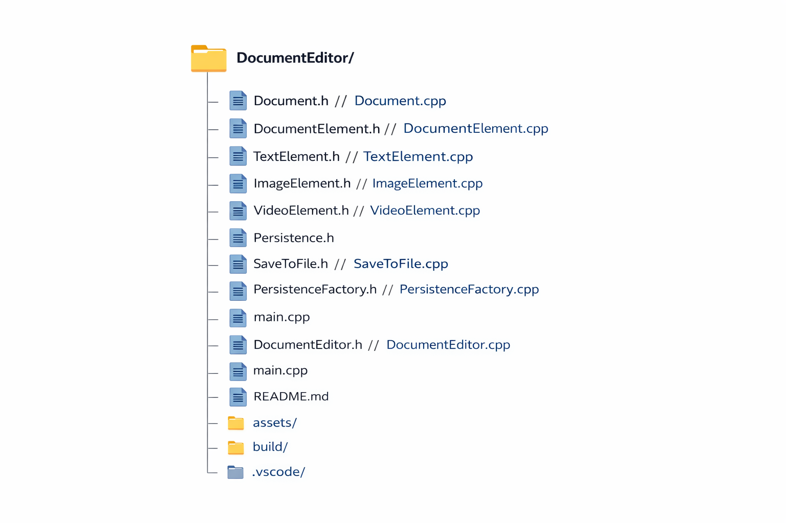
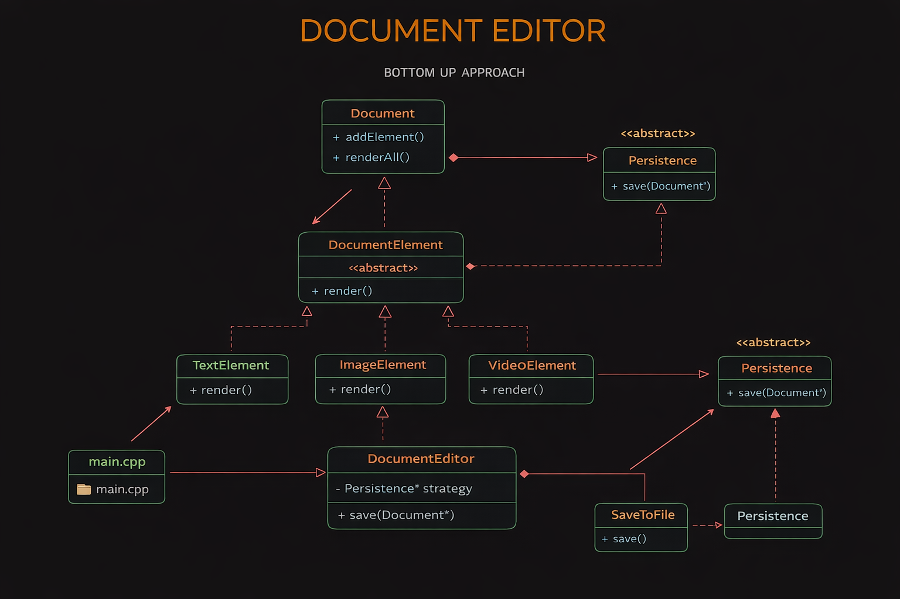

#  Document Editor (C++)


A modular **CLI-based Document Editor** built in C++ to demonstrate **clean architecture**, **SOLID principles**, and **Design Patterns** in a practical way.

> Focus: writing **maintainable, scalable, and extensible code** — not just working code.

---

##  Features

* Add elements:

  * Text
  * Image
  * Video
* View document content
* Save document using pluggable strategies
* Interactive CLI menu

---

##  Why this project?

Typical beginner code:

```cpp
doc.saveToFile();   // tightly coupled ❌
```

Problems:

* Hard to extend
* Hard to test
* Breaks when requirements change

This project solves that using:

```text
Abstraction ✔️  
Loose Coupling ✔️  
Extensibility ✔️  
```

---

##  SOLID Principles (Clear & Practical)

###  SRP — Single Responsibility Principle

**One class → One job**

* `Document` → manages elements
* `DocumentElement` → defines rendering
* `Persistence` → handles saving

 Why?
Avoids “God classes” and makes code easy to modify.

---

###  OCP — Open/Closed Principle

**Extend without modifying existing code**

```cpp
class DocumentElement {
    virtual void render() = 0;
};
```

Add new types:

* `TextElement`
* `ImageElement`
* `VideoElement`

 No change in old code 

---

###  LSP — Liskov Substitution Principle

**Child should behave like parent**

```cpp
DocumentElement* el = new TextElement();
el->render();   // works 
```

 Enables safe polymorphism

---

###  ISP — Interface Segregation Principle

**Small, focused interfaces**

```cpp
class Persistence {
    virtual void save(Document*) = 0;
};
```

 No unnecessary methods

---

###  DIP — Dependency Inversion Principle

**Depend on abstraction, not concrete**

```cpp
Persistence* strategy;   // 
```

NOT:

```cpp
SaveToFile*   // 
```

 Easily switch saving logic (file, DB, cloud)

---

##  Design Patterns Used

---

###  Strategy Pattern

**Problem:** Multiple ways to save data
**Solution:** Define a common interface

* `Persistence` → interface
* `SaveToFile` → concrete strategy
* `DocumentEditor` → context

**Flow:**

```text
DocumentEditor → Persistence → SaveToFile
```

 Change behavior without modifying code

---

###  Simple Factory Pattern

**Problem:** Avoid direct object creation (`new`) in main

```cpp
PersistenceFactory::createSaver("file");
```

 Centralized creation
 Cleaner and decoupled code

---

##  Project Structure

###  Visual Structure



<details>
<summary> View text structure</summary>

```
DocumentEditor/
│
├── Document.*
├── DocumentElement.*
├── TextElement.*
├── ImageElement.*
├── VideoElement.*
│
├── Persistence.h
├── SaveToFile.*
├── PersistenceFactory.*
│
├── DocumentEditor.*
├── main.cpp
│
├── assets/
│   ├── FileStructure.png
│   └── SequenceDiagram.png
│
├── README.md
└── .gitignore
```

</details>

---

##  System Flow



---

##  How to Run

###  Compile

```
g++ *.cpp -o main.exe
```

###  Run

```
main.exe
```

---

### CLI Preview

```
---- Document Editor ----
1. Add Text
2. Add Image
3. Add Video
4. Show Document
5. Save Document
6. Exit
```

---

##  Future Improvements

* Undo/Redo (Command Pattern)
* Smart pointers (memory safety)
* Database / Cloud persistence
* GUI version

---

##  Learning Outcome

This project helps you understand:

* How to apply SOLID in real code
* How to design extensible systems
* How Strategy removes tight coupling
* How Factory improves object creation

---

##  Author

**Nitin Kumar**

---
